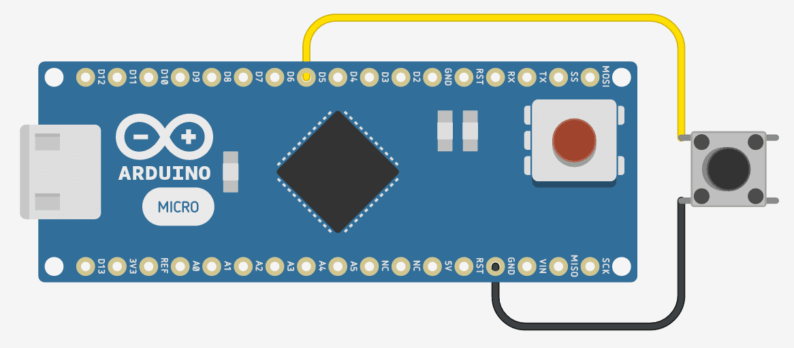
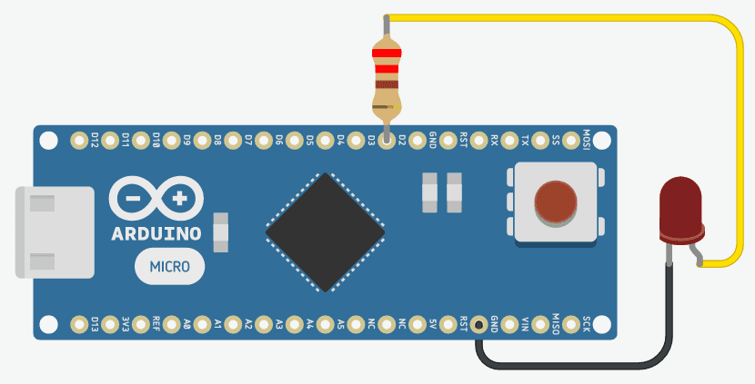

This is an ensemble of independent Arduino libraries to manage basic components such as buttons, potentiometers and leds. Code and functionalities are intentionally trivial and independent to favor fast prototyping, modifications and customization. Pros:

*   **modular** \- completely written in C++ with OOP programming principles and it doesn't interfere with other libraries
*   **non-blocking** \- delay() function is not used
*   **easy to customize**

This library was created with the help of [PlatformIO](https://platformio.org/).

Installation
------------

Simply copy the folder of the library you are interested in and import it with `#include NAME_OF_THE_LIBRARY.h`.

Library usage
-------------

### Button

Example usage of the button component with this library.

#### Hardware



#### Software
```
#include "Arduino.h"
#include 

Button button;

void setup()
{
 // initialize LED digital pin as an output.
 pinMode(LED_BUILTIN, OUTPUT);
}

void loop()
{
  button.getEvent();

  if (button.getToggle())
    digitalWrite(LED_BUILTIN, HIGH);
  else
    digitalWrite(LED_BUILTIN, LOW);

  delay(100);
}
```

### Potentiometer

Example usage of the potentiometer component with this library.

#### Hardware


#### Software
```
#include "Arduino.h"
#include 

Potentiometer potentiometer;

void setup()
{
  Serial.begin(9600);
}

void loop()
{
  Serial.println(potentiometer.getValue());
  Serial.println(potentiometer.getMappedValue(0, 5));
  Serial.println(potentiometer.getDoubleMappedValue(0, 5));

  delay(200);
}
```

### Led

Example usage of the led component with this library.

#### Hardware



#### Software
```
#include "Arduino.h"
#include 

Led led(2);

void setup() {
}

void loop() {
  led.blinkState(1000, 500);
}
```

Download the library
--------------------

The library is available on github at the following address:
[Arduino Basic Library](https://github.com/flaprimo/ArduinoBasicLibrary)